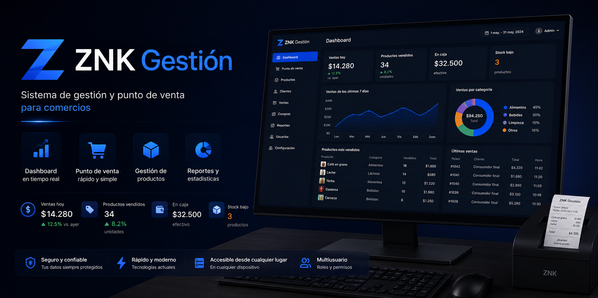
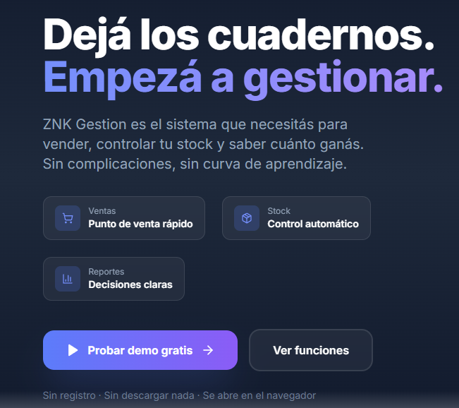
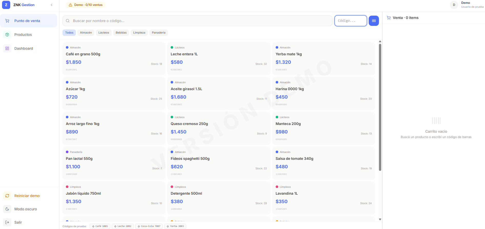
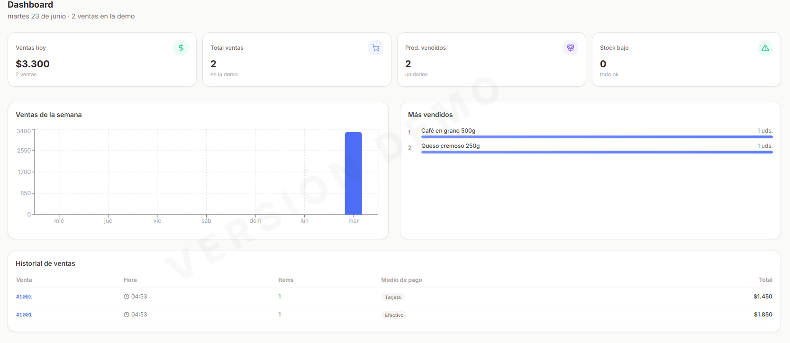
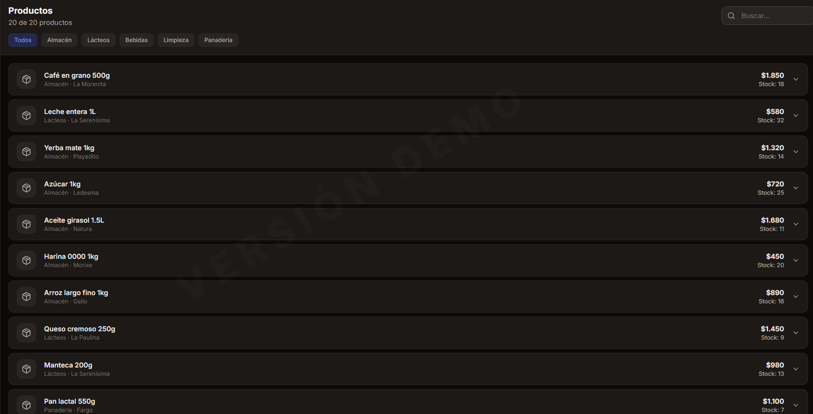

<p align="center">
  <br>
  <picture>
    <source media="(prefers-color-scheme: dark)" srcset="screenshots/banner-dark.png">
    
  </picture>
  <br><br>
  <em>Sistema de gestión y ventas para comercios minoristas</em>
</p>

<p align="center">
  <a href="https://eliashernan95.github.io/znk-gestion-demo/">
    
  </a>
  &nbsp;
  <a href="https://github.com/eliashernan95/znk-gestion-demo">
    
  </a>
</p>

<br>

<p align="center">
  
  
  
  
  
</p>

---

## ¿Para qué sirve?

Un comercio chico suele manejarse con cuaderno, planilla de Excel o un sistema viejo que nadie entiende. ZNK Gestion reemplaza todo eso por una sola herramienta, simple y directa.

Vendés en el punto de venta, el stock se descuenta solo, la caja se cierra con un clic y los reportes te dicen qué vendiste y cuánto ganaste.

Está pensado para kioscos, almacenes, perfumerías, ferreterías, verdulerías, indumentaria, pet shops y comercios generales.

---

## Funciones

| | |
|---|---|
| **Punto de venta** | Búsqueda por código de barras o nombre, carrito, múltiples medios de pago |
| **Control de stock** | Stock en tiempo real, alertas de stock bajo, categorías y marcas |
| **Dashboard** | Ventas del día, productos más vendidos, historial de operaciones |
| **Catálogo** | Productos con filtros por categoría, detalle de márgenes y costos |
| **Modo oscuro** | Alternancia con un botón, adaptable al entorno de trabajo |

La versión completa suma: caja diaria, usuarios y roles con permisos, reportes avanzados, importación desde Excel, facturación, backup y restauración.

---

## Vista previa

Las capturas se agregan en la carpeta [`screenshots/`](screenshots/). Una vez subidas, la galería se completa automáticamente.

| Landing | Punto de venta |
|:---:|:---:|
|  |  |
| **Dashboard** | **Productos** |
|  |  |

Podés tomar las capturas desde la [demo online](https://eliashernan95.github.io/znk-gestion-demo/) o corriendo el proyecto con `npm run dev`.

---

## Limitaciones de la demo

La demo es autocontenida: no usa backend, no persiste datos, no pide información real.

| Recurso | Límite |
|---|---|
| Productos | 20 |
| Ventas | 10 |
| Registro | No requiere |
| Datos reales | No usa |
| Contraseñas | No maneja |
| Persistencia | Se pierde al recargar |

---

## Tecnología

| Capa | Qué usa |
|---|---|
| Interfaz | React 18 + TypeScript |
| Build | Vite 5 |
| Estilos | Tailwind CSS 3 |
| Gráficos | Recharts |
| Íconos | Lucide React |
| Deploy | GitHub Actions + Pages |

La versión completa suma Node.js, Express, Prisma, SQLite y Electron para escritorio. Esta demo es solo el frontend de presentación.

---

## Ejecutar localmente

```bash
git clone https://github.com/eliashernan95/znk-gestion-demo.git
cd znk-gestion-demo
npm install
npm run dev
```

Abrí `http://localhost:5173`. Para generar una build de producción:

```bash
npm run build
npm run preview
```

---

## Estructura

```
src/
├── main.tsx
├── App.tsx
├── styles/
│   └── index.css
├── data/
│   └── demoData.ts              # 20 productos de prueba
├── components/
│   ├── landing/
│   │   ├── Navbar.tsx
│   │   ├── HeroSection.tsx
│   │   ├── BenefitsSection.tsx
│   │   ├── ModulesSection.tsx
│   │   ├── IdealForSection.tsx
│   │   ├── BeforeAfterSection.tsx
│   │   ├── CTASection.tsx
│   │   └── FooterSection.tsx
│   └── demo/
│       ├── DemoStore.tsx         # Estado global (carrito, ventas, stock)
│       └── DemoLayout.tsx        # Sidebar + header + marca de agua
└── pages/
    ├── LandingPage.tsx
    ├── DemoApp.tsx
    └── demo/
        ├── DemoPOS.tsx
        ├── DemoProducts.tsx
        └── DemoDashboard.tsx
```

---

## Estado

Este repositorio es una demo pública del sistema ZNK Gestion. Muestra la experiencia de uso pero no incluye backend, persistencia de datos ni funciones administrativas.

El sistema completo es privado. Si querés saber más, abrí un [issue](https://github.com/eliashernan95/znk-gestion-demo/issues) o escribime por GitHub.
